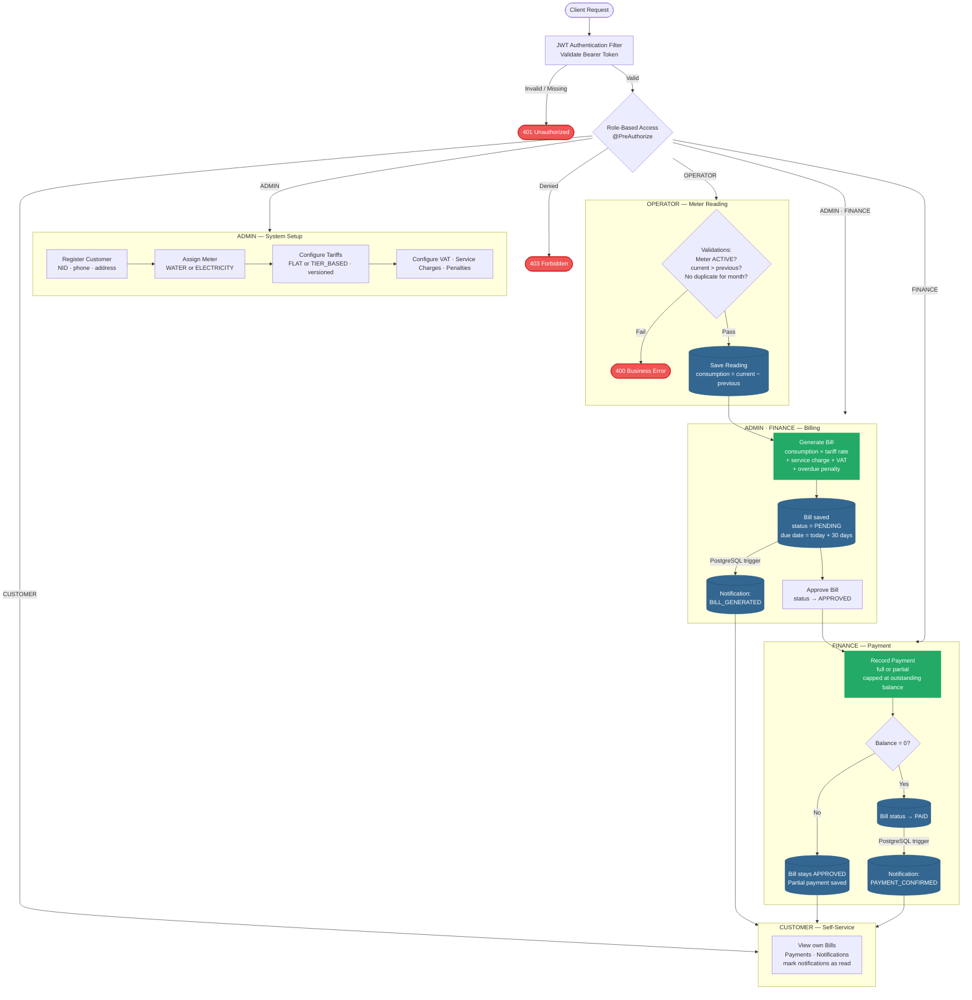

# WASAC Utility Billing System — Flow Diagram

Paste the Mermaid block below at: https://mermaid.live

```mermaid
flowchart TD
    Client([Client Request]) --> JWT[JWT Authentication Filter\nValidate Bearer Token]
    JWT --> |Invalid / Missing| E1([401 Unauthorized])
    JWT --> |Valid| Role{Role-Based Access\n@PreAuthorize}
    Role --> |Denied| E2([403 Forbidden])

    Role --> |ADMIN| Setup
    Role --> |OPERATOR| Reading
    Role --> |ADMIN · FINANCE| Billing
    Role --> |FINANCE| Payment
    Role --> |CUSTOMER| Portal

    subgraph Setup["  ADMIN — System Setup  "]
        direction LR
        SC[Register Customer\nNID · phone · address] --> SM[Assign Meter\nWATER or ELECTRICITY]
        SM --> ST[Configure Tariffs\nFLAT or TIER_BASED · versioned]
        ST --> SR[Configure VAT · Service Charges · Penalties]
    end

    subgraph Reading["  OPERATOR — Meter Reading  "]
        RV{Validations:\nMeter ACTIVE?\ncurrent > previous?\nNo duplicate for month?}
        RV --> |Fail| E3([400 Business Error])
        RV --> |Pass| RS[(Save Reading\nconsumption = current − previous)]
    end

    subgraph Billing["  ADMIN · FINANCE — Billing  "]
        RS --> BG[Generate Bill\nconsumption × tariff rate\n+ service charge + VAT\n+ overdue penalty]
        BG --> BP[(Bill saved\nstatus = PENDING\ndue date = today + 30 days)]
        BP --> |PostgreSQL trigger| BN[(Notification:\nBILL_GENERATED)]
        BP --> BA[Approve Bill\nstatus → APPROVED]
    end

    subgraph Payment["  FINANCE — Payment  "]
        BA --> PR[Record Payment\nfull or partial\ncapped at outstanding balance]
        PR --> PB{Balance = 0?}
        PB --> |No| PP[(Bill stays APPROVED\nPartial payment saved)]
        PB --> |Yes| PF[(Bill status → PAID)]
        PF --> |PostgreSQL trigger| PN[(Notification:\nPAYMENT_CONFIRMED)]
    end

    subgraph Portal["  CUSTOMER — Self-Service  "]
        CV[View own Bills\nPayments · Notifications\nmark notifications as read]
    end

    BN --> Portal
    PP --> Portal
    PN --> Portal

    style E1 fill:#e55,color:#fff,stroke:#c00
    style E2 fill:#e55,color:#fff,stroke:#c00
    style E3 fill:#e55,color:#fff,stroke:#c00
    style BP fill:#336791,color:#fff,stroke:#234f6e
    style RS fill:#336791,color:#fff,stroke:#234f6e
    style PP fill:#336791,color:#fff,stroke:#234f6e
    style PF fill:#336791,color:#fff,stroke:#234f6e
    style BN fill:#336791,color:#fff,stroke:#234f6e
    style PN fill:#336791,color:#fff,stroke:#234f6e
    style BG fill:#2a6,color:#fff,stroke:#1a5
    style PR fill:#2a6,color:#fff,stroke:#1a5
```
