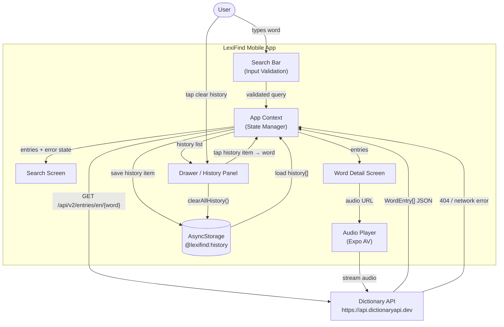

# LexiFind — Data Flow Diagram

```mermaid
flowchart TD
    User([User])

    subgraph MobileApp["LexiFind Mobile App"]
        SearchBar["Search Bar\n(Input Validation)"]
        SearchScreen["Search Screen"]
        WordDetailScreen["Word Detail Screen"]
        DrawerHistory["Drawer / History Panel"]
        AudioPlayer["Audio Player\n(Expo AV)"]
        AppContext["App Context\n(State Manager)"]
        AsyncStorage[("AsyncStorage\n@lexifind:history")]
    end

    DictionaryAPI["Dictionary API\nhttps://api.dictionaryapi.dev"]

    User -->|"types word"| SearchBar
    SearchBar -->|"validated query"| AppContext
    AppContext -->|"GET /api/v2/entries/en/{word}"| DictionaryAPI
    DictionaryAPI -->|"WordEntry[] JSON"| AppContext
    DictionaryAPI -->|"404 / network error"| AppContext
    AppContext -->|"entries + error state"| SearchScreen
    AppContext -->|"entries"| WordDetailScreen
    AppContext -->|"save history item"| AsyncStorage
    AsyncStorage -->|"load history[]"| AppContext
    AppContext -->|"history list"| DrawerHistory
    DrawerHistory -->|"tap history item → word"| AppContext
    WordDetailScreen -->|"audio URL"| AudioPlayer
    AudioPlayer -->|"stream audio"| DictionaryAPI
    User -->|"tap clear history"| DrawerHistory
    DrawerHistory -->|"clearAllHistory()"| AsyncStorage
```
