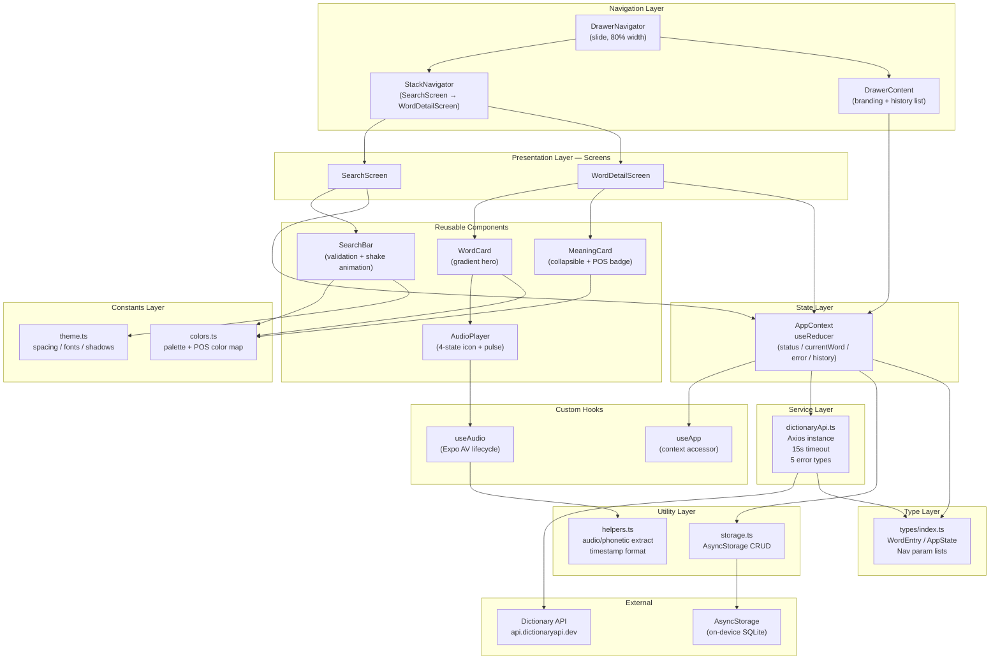

# LexiFind — Architecture Diagram

**Figma Design:** [LexiFind UI](https://www.figma.com/design/Xd2oEHbjKM5Alb67NuTkBs/LexiFind?node-id=0-1&t=8bAS6BuROP9yK9DF-1)

```mermaid
graph TD
    subgraph Presentation["Presentation Layer — Screens"]
        SS["SearchScreen"]
        WD["WordDetailScreen"]
    end

    subgraph Navigation["Navigation Layer"]
        DR["DrawerNavigator\n(slide, 80% width)"]
        ST["StackNavigator\n(SearchScreen → WordDetailScreen)"]
        DC["DrawerContent\n(branding + history list)"]
    end

    subgraph Components["Reusable Components"]
        SB["SearchBar\n(validation + shake animation)"]
        WC["WordCard\n(gradient hero)"]
        AP["AudioPlayer\n(4-state icon + pulse)"]
        MC["MeaningCard\n(collapsible + POS badge)"]
    end

    subgraph StateLayer["State Layer"]
        CTX["AppContext\nuseReducer\n(status / currentWord / error / history)"]
    end

    subgraph Hooks["Custom Hooks"]
        UA["useAudio\n(Expo AV lifecycle)"]
        UAS["useApp\n(context accessor)"]
    end

    subgraph Services["Service Layer"]
        API["dictionaryApi.ts\nAxios instance\n15s timeout\n5 error types"]
    end

    subgraph Utils["Utility Layer"]
        STG["storage.ts\nAsyncStorage CRUD"]
        HLP["helpers.ts\naudio/phonetic extract\ntimestamp format"]
    end

    subgraph Constants["Constants Layer"]
        CLR["colors.ts\npalette + POS color map"]
        THM["theme.ts\nspacing / fonts / shadows"]
    end

    subgraph Types["Type Layer"]
        TYP["types/index.ts\nWordEntry / AppState\nNav param lists"]
    end

    subgraph External["External"]
        DAPI["Dictionary API\napi.dictionaryapi.dev"]
        ASST["AsyncStorage\n(on-device SQLite)"]
    end

    DR --> ST
    DR --> DC
    ST --> SS
    ST --> WD
    SS --> SB
    SS --> CTX
    WD --> WC
    WD --> MC
    WD --> CTX
    WC --> AP
    AP --> UA
    DC --> CTX
    CTX --> UAS
    CTX --> API
    CTX --> STG
    API --> DAPI
    STG --> ASST
    UA --> HLP
    SB --> CLR
    SB --> THM
    WC --> CLR
    MC --> CLR
    API --> TYP
    CTX --> TYP
```
