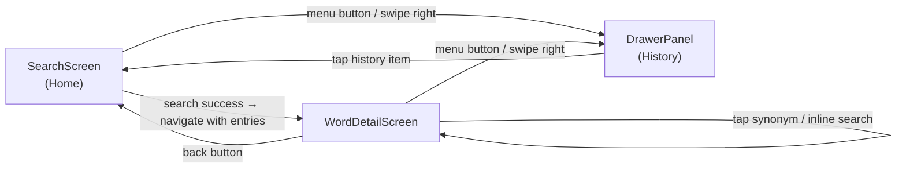

# LexiFind — API Endpoints & App Pages

---

## API Endpoints

All calls go to the free Dictionary API. No authentication required.

```mermaid
classDiagram
    class DictionaryAPI {
        baseURL: https://api.dictionaryapi.dev/api/v2
        timeout: 15000ms
    }

    class LookupWord {
        +GET /entries/en/{word}
        param word: string
        returns: WordEntry[]
        error 404: word not found
        error 5xx: server error
    }

    class AudioPronunciation {
        +GET audio URL (from response body)
        source: phonetics[].audio field
        format: .mp3
        streamed via Expo AV
        note: URL lives inside WordEntry response
    }

    DictionaryAPI --> LookupWord
    DictionaryAPI --> AudioPronunciation
```

### Endpoint Detail

| # | Method | Path | Description | Success | Error |
|---|--------|------|-------------|---------|-------|
| 1 | GET | `/api/v2/entries/en/{word}` | Look up a word — returns array of entries with meanings, phonetics, and audio URLs | `200 WordEntry[]` | `404 {"title":"No Definitions Found"}` |
| 2 | GET | `{phonetics[n].audio}` | Stream MP3 pronunciation audio (URL extracted from entry #1 response) | `200 audio/mpeg` | `404 / network` |

### Response Shape (simplified)

```
WordEntry {
  word: string
  phonetics: [{ text, audio }]
  meanings: [{
    partOfSpeech: string
    definitions: [{ definition, example, synonyms[], antonyms[] }]
    synonyms: string[]
    antonyms: string[]
  }]
  license: { name, url }
  sourceUrls: string[]
}
```

### Error Handling Matrix

| Scenario | Error Type | User Message |
|----------|-----------|--------------|
| Word not in dictionary | `not_found` | "No definitions found for '{word}'" |
| No internet | `network` | "Network error. Check your connection." |
| Request > 15s | `timeout` | "Request timed out. Try again." |
| Malformed response | `parse` | "Unexpected response from server." |
| Any other | `unknown` | "Something went wrong." |

---

## App Pages (Screens)



### Screen Inventory

| # | Screen / Panel | Route Name | Entry Point | Key Responsibilities |
|---|---------------|-----------|-------------|----------------------|
| 1 | **Search Screen** | `Search` | App launch | Search input, suggestion chips, pull-to-refresh, error/empty states |
| 2 | **Word Detail Screen** | `WordDetail` | After successful search or history tap | Show WordCard + all MeaningCards, inline re-search, back nav |
| 3 | **Drawer / History Panel** | `DrawerContent` | Swipe right or menu button from any screen | Show search history list, navigate to word, clear history with confirm dialog |

### Per-Screen Component Map

#### SearchScreen
| Component | Purpose |
|-----------|---------|
| `GradientHeader` | Branding bar with menu button and animated title |
| `SearchBar` | Validated text input with shake animation on error |
| `SuggestionChips` | 6 preset word buttons for quick demo |
| `ErrorBanner` | Inline error card (not_found / network / timeout) |
| `LoadingIndicator` | Spinner while API call is in flight |

#### WordDetailScreen
| Component | Purpose |
|-----------|---------|
| `TopBar` | Back button + menu button |
| `InlineSearchBar` | Re-search without leaving screen |
| `WordCard` | Gradient hero: word text, phonetic, stats strip |
| `AudioPlayer` | Play / stop pronunciation with 4-state icon |
| `MeaningCard[]` | One collapsible card per meaning; POS badge, definitions, examples, synonyms/antonyms |

#### DrawerContent (History Panel)
| Component | Purpose |
|-----------|---------|
| `GradientBranding` | LexiFind logo and tagline header |
| `HistoryItem[]` | Tappable row: word + relative timestamp ("2h ago") |
| `ClearHistoryButton` | Alert confirmation before wiping AsyncStorage |
| `EmptyHistoryPlaceholder` | Shown when history list is empty |

---

## Local Storage Schema

| Key | Type | Description |
|-----|------|-------------|
| `@lexifind:history` | `JSON string → SearchHistoryItem[]` | Ordered list of searched words (max 50, no duplicates, newest first) |

```
SearchHistoryItem {
  word: string       // normalized lowercase
  timestamp: number  // Date.now()
}
```
