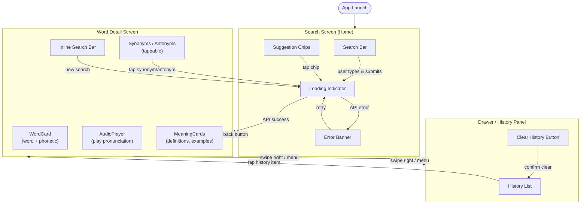

# LexiFind — Screen Flow Diagram

```mermaid
flowchart TD
    Launch(["App Launch"])

    subgraph Search["Search Screen (Home)"]
        S1["Search Bar"]
        S2["Suggestion Chips"]
        S3["Loading Indicator"]
        S4["Error Banner"]
    end

    subgraph Detail["Word Detail Screen"]
        D1["WordCard\n(word + phonetic)"]
        D2["AudioPlayer\n(play pronunciation)"]
        D3["MeaningCards\n(definitions, examples)"]
        D4["Synonyms / Antonyms\n(tappable)"]
        D5["Inline Search Bar"]
    end

    subgraph Drawer["Drawer / History Panel"]
        H1["History List"]
        H2["Clear History Button"]
    end

    Launch --> Search
    S1 -->|"user types & submits"| S3
    S2 -->|"tap chip"| S3
    S3 -->|"API success"| Detail
    S3 -->|"API error"| S4
    S4 -->|"retry"| S3

    D4 -->|"tap synonym/antonym"| S3
    D5 -->|"new search"| S3

    Search -->|"swipe right / menu"| Drawer
    Detail -->|"swipe right / menu"| Drawer
    Detail -->|"back button"| Search

    H1 -->|"tap history item"| Detail
    H2 -->|"confirm clear"| H1
```
